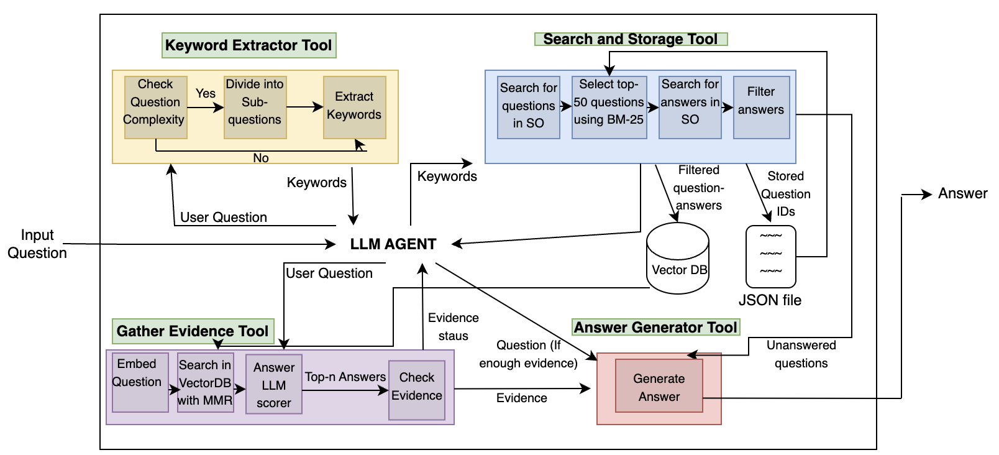

# StackRAG
This is a Retrieval Augmented Generation (RAG)-based ai-agent designed for utilizing advanced reasoning capabilities of GPT-4 as well as community knowledge available in StackOverflow to provide well-grounded responses to user-given questions. Our agent is built using Langchain Agent Framework. The overall architecture diagram is presented below.

# Architecture


Before staring make sure you have the following:
1. OpenAI API Key (https://platform.openai.com/docs/quickstart?context=python)
2. Cohere AI API Key (https://docs.cohere.com/docs)
3. An index in Pinecone (https://www.pinecone.io/)
4. StackAPI API Key (Follow instructions presented in the answer of this StackOverflow Post: https://stackoverflow.com/questions/61240974/how-to-retrieve-data-from-stack-exchange-api-with-user-authentication)

# How to Setup
Follow these instructions to run the program
### Setup the environment variables
Copy .env.example file into .env

```shell
cp .env.example .env
```

After copying the environment variables into .env file, fill them in

OPENAI_API_KEY=Your OpenAI API Key

PINECONE_ENVIRONMENT=Your Pinecone Environment for storing data ("gcp-starter" if using the default free version)

PINECONE_API_KEY=The API Key of the index that is going to store data

PINECONE_INDEX_NAME=The name of the index where you store data

SO_CLIENT_SECRET = Your StackOverflow secret client key

SO_KEY = Your StackOverflow API key

### Install Necessary Dependencies

```shell
pip3 install -r requirements.txt
```

### Get the USer-Interface
In order to get the UI where you can interact with our agent, run the following command

```shell
streamlit run ai-agent/ai-agent-ui.py
```

## Citation

```
@article{abrahamyanStackRAG,
  title={StackRAG Agent: Improving Developer Answers with Retrieval-Augmented Generation},
  author={Abrahamyan, Davit and Fard, Fatemeh Hendijani},
  journal={arXiv preprint arXiv:2406.13840},
  year={2024}
}
```
